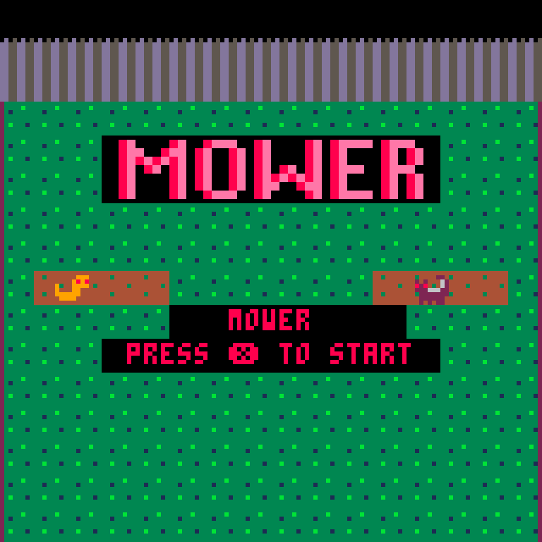
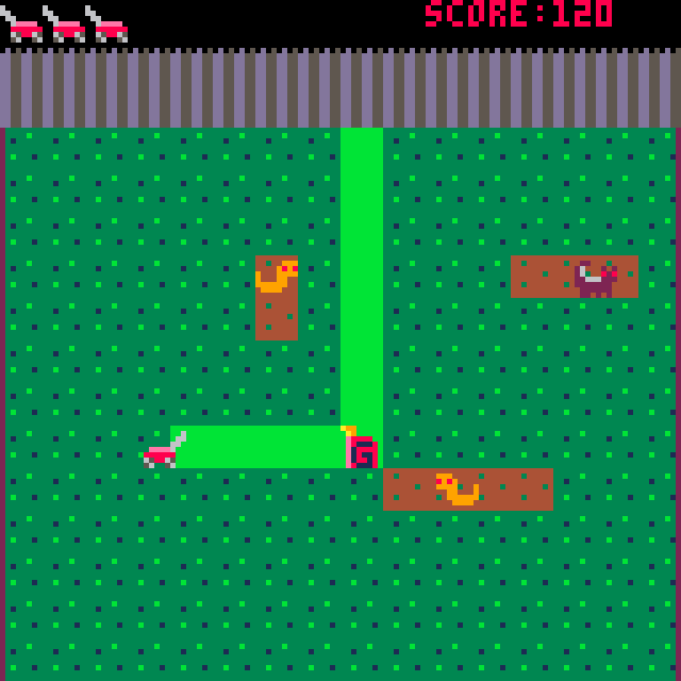

  <h1>Welcome to My Studio</h1>
  
Hi, I'm Jarod McCoy. I am a game design student. This site documents my playable prototypes.

  
  <h3>My Skills</h3>
  <ul>
    <li><strong>Engines:</strong> Twine, Pico-8</li>
    <li><strong>Languages:</strong> Lua, HTML</li>
    <li><strong>Tools:</strong> Pico-8, Figma</li>
  </ul>

<h2>🎮 Game Projects</h2>

<!-- Project 1 -->

  <h3>1. Mower</h3>
  
<strong>Genre:</strong> 2D Arcade Game | <strong>Engine:</strong> Pico-8

  
  
  
  
  
A Dig-Dug insipired game where you mow your lawn and capture wild animals. Features tile-based movement and easily-created levels with 3 levels built in.

  
  <iframe src="https://www.lexaloffle.com/bbs/widget.php?pid=mower_" allowfullscreen width="621" height="513" style="border:none; overflow:hidden"></iframe>
  

<!-- Project 2 -->

  <h3>2. Last Voyage of the Manatee</h3>
  
<strong>Genre:</strong> Text-Adventure | <strong>Engine:</strong> Twine

  
  
A text-based space adventure. As the ship's engineer, try to save your fellow crewmates and yourself from impending doom.

  
  

    <a href="#" class="btn">Download Build</a>
  

